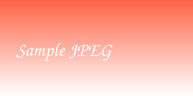

# Kitchen Sink: Markdown Feature Comparison

This document deliberately exercises every feature we care about.
Each numbered section is a feature probe with sentinel text that a
checker script can look for inside the rendered PDF.

## F01 · Headings

### Level three heading

#### Level four heading

##### Level five heading

###### Level six heading

The heading above says "level six heading" — if you can read it, h6 rendered.

## F02 · Emphasis

This sentence is **boldly bold**, *softly italic*, ***boldly italic***,
and this word is ~~struck through~~ forever.

## F03 · Inline code and entities

Inline code like `if a < b && c > d { puts "hi" }` must keep its angle
brackets. Entities: © 2026 — café & crème … ✓ done.

## F04 · Links

An [inline link to Example](https://example.com), a [reference link
to MDN][mdn], an autolink https://crystal-lang.org directly in text,
and a mail address <hello@example.com>.

[mdn]: https://developer.mozilla.org

## F05 · Image: local PNG


## F06 · Image: local JPEG



## F07 · Image: SVG


## F08 · Image: animated GIF


## F09 · Image: WebP


## F10 · Image: remote HTTPS


## F11 · Image: data URI


## F12 · Blockquotes

> A single-level quote with a sentinel: the quirkly quokka quips.
>
> > A nested quote: the baffled badger bounces.

## F13 · Lists, nested and offset

* First unordered item
* Second item with a nested list:
  * Inner alpha
  * Inner beta
* Third unordered item

5. Fifth ordered item (list starts at five)
6. Sixth ordered item
7. Seventh ordered item

## F14 · Task lists

- [x] Ship the markpdf renderer
- [x] Write the comparison harness
- [ ] Take a well-earned nap

## F15 · Table with alignment

| Left aligned | Centered | Right aligned |
|:-------------|:--------:|--------------:|
| quick        | brown    | fox           |
| lazy         | dog      | jumps         |
| **bold**     | *italic* | `code`        |

## F16 · Wide table under pressure

| Col 1 | Col 2 | Col 3 | Col 4 | Col 5 | Col 6 | Col 7 | Col 8 | Col 9 | Col 10 |
|-------|-------|-------|-------|-------|-------|-------|-------|-------|--------|
| aardvark | borzoi | chinchilla | dromedary | echidna | flamingo | gopher | hedgehog | iguana | jaguar |
| 1 | 2 | 3 | 4 | 5 | 6 | 7 | 8 | 9 | 10 with extra words squeezed in |

## F17 · Code fence with language: crystal

```crystal
# A crystalline example: the zesty zebra zooms.
class Greeter
  def initialize(@name : String)
  end

  def greet
    puts "Hello, #{@name}!"
  end
end

Greeter.new("World").greet
```

## F18 · Code fence with language: python

```python
"""The mellow mongoose meanders."""
def fib(limit: int):
    a, b = 0, 1
    while a < limit:
        yield a
        a, b = b, a + b

print(list(fib(50)))
```

## F19 · Code fence without language, and indented code

```
plain fenced block: the cautious cougar crouches.
```

    indented code block: the timid tapir tiptoes.

## F20 · Long unbreakable line in code

```
SHORT=ok LONG=https://example.com/aaaaaaaaaabbbbbbbbbbccccccccccddddddddddeeeeeeeeeeffffffffffgggggggggghhhhhhhhhhiiiiiiiiiiabcdefghij0123456789abcdefghij0123456789 TRAILING=done
```

## F21 · Footnotes

Here is a footnote reference[^1], and a named one[^note].

[^1]: Knuth, *The Art of Computer Programming*, 1968.
[^note]: A richer footnote with **bold** and a [link](https://example.com).

## F22 · GFM alerts

> [!NOTE]
> Highlights the sunny sidekick salutes.

> [!TIP]
> Optional advice: the tireless turtle trots.

> [!IMPORTANT]
> Crucial content: the lively lemur leaps.

> [!WARNING]
> Urgent: the worried walrus whimpers.

> [!CAUTION]
> Negative consequences: the cranky crab clacks.

## F23 · Inline HTML

Press <kbd>Ctrl</kbd>+<kbd>P</kbd> to print, find <mark>marked text</mark>,
water is H<sub>2</sub>O, and x<sup>2</sup>+y<sup>2</sup>=r<sup>2</sup>.

## F24 · Emoji

Emoji check: thumbs up 👍, party 🎉, rocket 🚀 — if these are boxes, the
emoji font is missing.

## F25 · Unicode: accents, CJK, RTL, symbols

Señor Cárdenas über straße café. Chinese: 中文排版测试. Arabic: مرحبا
بالعالم. Symbols: ∑ ∫ ≈ ≠ ± °.

## F26 · Math

Inline math $E = mc^2$ and display math:

$$
\int_0^\infty e^{-x}\,dx = 1
$$

## F27 · Rules and breaks

---

A paragraph with a hard break at the end (two trailing spaces)  
followed by more text in the same paragraph, and then a soft-wrapped
sentence continuing naturally.

---

## F28 · Page-breaking behavior

The crystal code below is long enough that it (or something nearby)
must split across a page boundary in most page sizes. Watch for
clipped lines, orphaned headers, or missing backgrounds.

```crystal
def page_filler
  lines = [] of String
  40.times do |index|
    lines << "filler line #{index + 1}: the patient penguin perches"
  end
  lines
end

page_filler.each { |line| puts line }
```

And a closing paragraph: the endearing emu emigrates eastward.

## F29 · Hyphenation at line ends

A renderer that knows hyphenation breaks long words with a hyphen at
the line end instead of leaving loose lines; one that does not can
only move the whole word down. All words below are long, lowercase,
and free of hard hyphens, so any hyphen at a line break here comes
from real hyphenation.

Internationalization electroencephalography incomprehensibilities
counterrevolutionaries internationalization electroencephalography
incomprehensibilities counterrevolutionaries internationalization
electroencephalography incomprehensibilities counterrevolutionaries
internationalization electroencephalography incomprehensibilities
counterrevolutionaries internationalization electroencephalography
incomprehensibilities counterrevolutionaries
